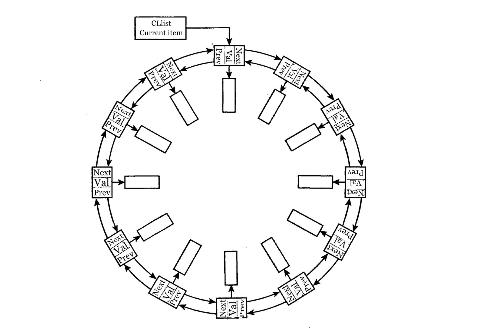

# Cyclic Linked List
***
## What is it?
***
Loop lists are single or doubly-linked lists that chase their own tail:
A points to B, B points to C, C points to D, and D points to A.
They are better suited for cyclic data such as train schedules.
These lists are missing the first and last items.
Therefore, it is necessary to introduce the concept of the current position.

Find out more about [cycle detection here](https://en.wikipedia.org/wiki/Cycle_detection).

This picture shows similar lists:

